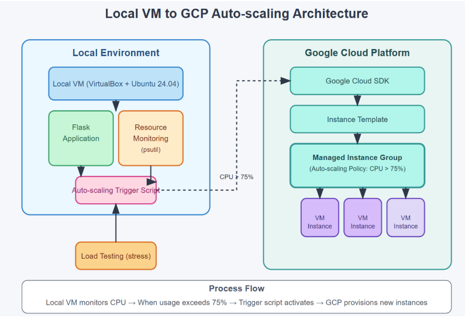

# Local VM to GCP Auto-scaling Architecture 🚀💻☁️

## Overview 🌍📊🔧
This project demonstrates an auto-scaling mechanism where a local Virtual Machine (VM) monitors its CPU usage and triggers instance provisioning on Google Cloud Platform (GCP) when the usage exceeds a defined threshold. 

## Video Demo 🌍🖥️
### https://drive.google.com/file/d/18-DLYpHt33vd8Mq92NST774cQO-KEs9-/view?usp=sharing

## Architecture 🏗️🖥️⚙️
The system consists of two main environments:
1. **Local Environment** (Ubuntu 24.04 on VirtualBox) 🏠🐧
   - Runs a Flask application. 
   - Monitors system resources using `psutil`. 
   - Contains an auto-scaling trigger script that interacts with GCP. 
   - Simulates high CPU load using `stress`. 

2. **Google Cloud Platform (GCP) ☁️🌎**
   - Uses Google Cloud SDK to interact with cloud services. 
   - Creates instances from a predefined Instance Template. 
   - Manages instance scaling through a Managed Instance Group (MIG) with an auto-scaling policy (CPU > 75%). 

 

### Explanation of the Architecture Diagram 🏗️🔍🖥️
- **Local VM**: The environment where the Flask application runs. It includes:
  - A **Flask application** to serve requests. 
  - A **resource monitoring script** using `psutil` to track CPU utilization. 
  - An **auto-scaling trigger script** that runs when CPU usage exceeds 75%, sending a request to GCP to provision new instances. 
- **Load Testing**: The `stress` command is used to artificially increase CPU load. 
- **Google Cloud SDK**: The interface between the local VM and GCP, allowing VM creation and management. 
- **Instance Template**: Defines the VM configuration (machine type, boot disk, startup script, etc.). 
- **Managed Instance Group (MIG)**: A group of VM instances that auto-scales based on CPU utilization policies. 

## Process Flow 🔄📊💡
1. Local VM monitors CPU usage. 
2. When CPU usage exceeds 75%, the auto-scaling trigger script is activated. 
3. The script provisions new VM instances on GCP using an instance template. 
4. The Managed Instance Group (MIG) handles scaling up as needed. 

## Prerequisites 📝🔧✅
- Ubuntu 24.04 running on VirtualBox. 
- Python and required dependencies (`psutil` for resource monitoring). 
- Google Cloud SDK installed and authenticated. 
- A predefined GCP Instance Template for provisioning VMs. 
- A Managed Instance Group (MIG) configured with auto-scaling based on CPU usage. 

## Installation 🛠️📦🚀
### 1. Install Required Packages on Linux VM 💻🐧🔧
```sh
sudo apt update && sudo apt upgrade -y
sudo apt install python3 python3-pip virtualenv -y
sudo apt install stress -y
```

### 2. Clone this repository: 🏗️🔗💾
```sh
git clone <repository_url>
cd <repository_folder>
```

### 3. Create and activate a virtual environment: 🔄🐍🛠️
```sh
virtualenv venv
source venv/bin/activate
```

### 4. Install dependencies: 📦💡🚀
```sh
pip install -r requirements.txt
```

### 5. Authenticate with Google Cloud: ☁️🔑🔗
```sh
gcloud auth login
gcloud config set project <your_project_id>
```

## Setting Up GCP Resources ☁️🏗️📊
### 1. Create an Instance Template 🏗️⚙️🖥️
```sh
gcloud compute instance-templates create auto-scale-template \
    --machine-type e2-medium \
    --image-family ubuntu-2004-lts \
    --image-project ubuntu-os-cloud \
    --boot-disk-size 20GB \
    --tags http-server \
    --metadata=startup-script='#! /bin/bash
    sudo apt update
    sudo apt install -y python3-pip
    pip3 install flask psutil'
```

### 2. Create a Managed Instance Group 📦🔄💡
```sh
gcloud compute instance-groups managed create auto-scale-group \
    --base-instance-name auto-scale-instance \
    --size 1 \
    --template auto-scale-template \
    --zone us-central1-a 
```

### 3. Configure Auto-scaling Policy 📈🔥🔄
```sh
gcloud compute instance-groups managed set-autoscaling auto-scale-group \
    --max-num-replicas 5 \
    --target-cpu-utilization 0.75 \
    --cool-down-period 60 \
    --zone us-central1-a 
```

### 4. Allow HTTP Traffic to Instances 🌐🔓🚀
```sh
gcloud compute firewall-rules create allow-http \
    --allow tcp:80 \
    --target-tags http-server
```

## Running the Project 🚀💻🔄
### 1. Start the Flask application: 🌐🖥️🔥
```sh
python app.py
```

### 2. Start the resource monitoring and auto-scaling script: 📊🔄☁️
```sh
python auto_scaling_script.py
```

### 3. Simulate high CPU load to trigger scaling: 💥📈🖥️
```sh
stress --cpu 4 --timeout 60s
```

## Future Enhancements 🔮🚀💡
- Implement logging and alerts for better monitoring. 📊🔔
- Add support for memory-based scaling. 📈
- Integrate with Kubernetes for containerized scaling. 🐳📦

## License 📜✅🚀
This project is licensed under the MIT License. 🎉🔓📃

## Contributors 🤝🛠️🌍
- Prem Oswal 🎓💡🚀

